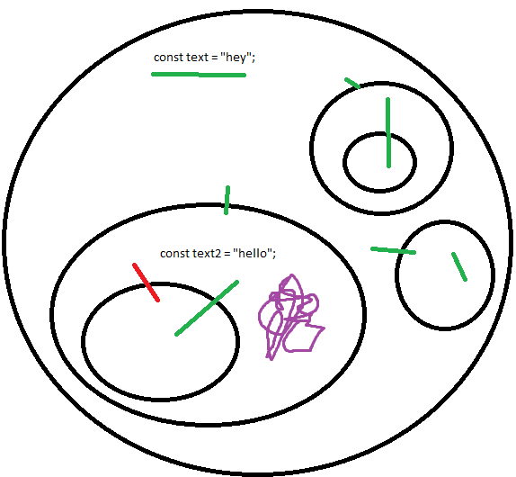

# What is the scope of a variable in JavaScript? Explain the difference between global and local scope.



Green lines is how the global variable ‘text’ is seen. The red line is how the ‘text2’ is seen. Since ‘text2’ is inside the purple circle, it can’t be seen in the big circle, but it can be seen in the smaller circle inside of the purple circle.

# Forms in React.

## How are controlled components different from uncontrolled components in React forms?

## Explain the role of the onChange event in form handling and show examples.

# sub routing

## Explain how sub routing is working

Sub-routing, also known as nested routing, is a concept in routing where certain routes are defined within other routes. This is particularly useful in scenarios where a part of the application has its own sub-sections, each with its own unique view.

In React Router, this is achieved by defining a Route within a Route. The outer Route is responsible for rendering the general layout and the inner Route is responsible for rendering the specific content for the sub-route.

React Router reads from top to bottom when determening which one of the sub routes to use.

## Show an example of using sub routing with the element.

```JS
import React from 'react';
import { BrowserRouter, Link, Route, Routes, Outlet } from "react-router-dom";

function Example() {
    return
    <>
        <BrowserRouter>
            <Routes>
                <Route path="/" element="index">
                    <Route path="home" element="Home"/>
                    <Route path="about" element="About"/>
                </Route>
            </Routes>
        </BrowserRouter>
    </>
}

```
